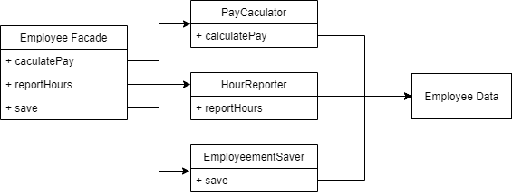
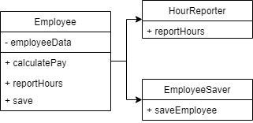

# 3. 설계 원칙

좋은 소프트웨어 시스템은 깔끔한 코드로 부터 시작한다.  
좋은 벽돌로 좋은 아키텍처를 정의하는 원칙이 바로 ```SOLID```이다.  

```SOLID``` 원칙의 목적은 중간 수준의 소프트웨어 구조가 아래와 같도록 만드는 데 있다.
- 변경에 유연하다.
- 이해하기 쉽다.
- 많은 소프트웨어 시스템에 사용될 수 있는 컴포넌트의 기반이 된다.

그래서 ```SOLID``` 가 무엇인가

* SRP: 단일 책임 원칙  
  각 소프트웨어 모듈은 변경의 이유가 하나, 단 하나여야만 한다.  
  
* OCP: 개방-폐쇄 원칙  
  코드를 수정하기보다 반드시 새로운 코드를 추가하는 방식으로 시스템의 행위를 변경할 수 있도록 설계해야만 소프트웨어 시스템을 쉽게 변경 할 수 있다는 것이 이 원칙의 요지다.  
  
* LSP: 리스코프 치환 원칙  
  상호 대체 가능한 구성요소를 이용해 소프트웨어 시스템을 만들 수 있으려면, 이들 구성요소는 반드시 서로 치환 가능하야 한다는 계약을 반드시 지켜야 한다.  
  
* ISP: 인터페이스 분리 원칙
  이 원칙에 따르면 소프트웨어 설계자는 사용하지 않은 것에 의존하지 않아야 한다.
  
* DIP: 의존성 역전의 원칙
  고수준 정책을 구현하는 코드는 저수준 세부사항을 구현하는 코드에 절대로 의존해서는 안 된다. 대신 세부사항이 정책에 의존해야 한다.

  # SRP: 단일 책임 원칙
> 하나의 모듈은 하나의, 오직 하나의 액터에 대해서만 책임져야 한다.

모듈은 단순히 함수와 데이터 구조로 구성된 응집된 집합이다.  
단일 액터를 책임지는 코드를 함께 묶어주는 힘이 바로 응집성이다.  
아마도 이 원칙을 이해하는 가장 좋은 방법은 이 원칙을 위반하는 징후들을 살펴보는 것이다.

#### 징후 1: 우발적 중복
액터가 의존하는 코드를 너무 가까이 배치했기 때문에 발생한다.  
SRP는 서로 다른 액터가 의존하는 코드를 서로 분리하라고 말한다.

#### 징후 2: 병합
소스 파일에 다양하고 많은 메서드를 포함하면 병합이 자주 발생하리라고 짐작한다.  
메서드가 서로 다른 액터를 책임진다면 병합이 발생할 가능성은 높아진다.  
이 문제를 벗어나는 방법은 서로 다른 액터를 뒷바침하는 코드를 서로 분리하는 것이다.

#### 해결책
이 문제의 해결책은 다양하다.  
그 모두가 메서드를 각기 다른 클래스로 이동시키는 방식이다.
가장 확실한 해결책은 데이터와 메서드를 분리하는 방식이다.  
* 아무런 메서드가 없는 간단한 데이터 구조인 EmployeeData 클래스를 만들어 세 개의 클래스가 공유하도록 한다.
* 각 클래스는 자신의 메서드에 필요한 소스코드만 포함한다.
* 세 클래스는 서로의 존재를 몰라야 한다.
* 따라서 우연한 중복을 피할 수 있다.
  

반면 이 해결책은 개발자가 세 가지 클래스를 인스턴스화 하고 추적해야 한다는 게 단점이다.  
이러할때 흔히 쓰는 기법으로 ```퍼사드``` 패턴이 있다.  


* EmployeeFacade에 코드는 거의 없다.
* 이 클래스는 세 클래스의 객체를 생성하고
* 요청된 메서드를 가지는 객체로 위임하는 일을 책임진다.

어떤 개발자는 가장 중요한 업무 규칙을 데이터와 가깝게 배치하는 방식을 선호한다.  
이 경우라면 가장 중요한 메서드는 기존의 Employee 클래스에 그대로 유지하되  
Employee 클래스를 덜 중요한 나머지 메서드들에 대한 퍼사드로 사용할 수도 있다.  

